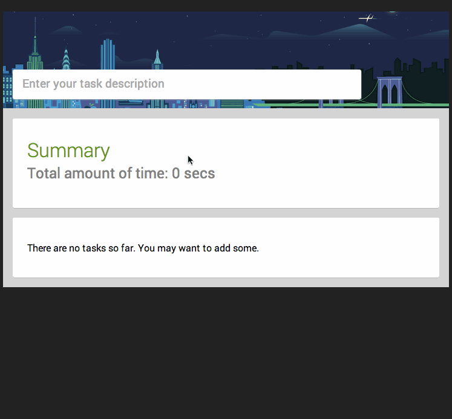

Time tracker
----

My small playground for Angular.js. An app I'm incrementally developing which happens to also help me keep track of my time I spent on certain tasks.



## Getting it

Just exec a `git clone` followed by

```
$ npm install
$ bower install
```

..to get all dependencies.